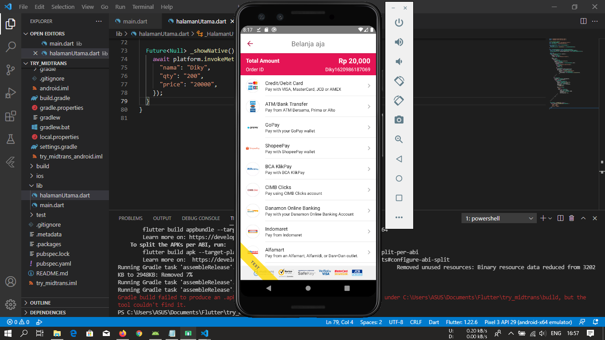

# try_midtrans

Create Flutter implementation with Midtrans Payment Gateway

This Project included features

- Midtrans Payment Gateway

## Getting Started

- Clone this Repository
- You can change's Base URL and Client key to your own. Read documentation at https://docs.midtrans.com/
- Recomend\*, i try this app with build release apk. You can type in your terminal "flutter build apk". Location APK (Build/app/outputs/apk/sandbox/release) and try to install it in to your Smartphone
- Make sure your Internet is connected

## Screenshot

